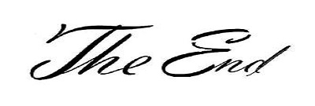

# HTML 入门笔记 1


## HTML 的出现

HTML 是由一名叫 Tim Berners-Lee 的科学家发明的。目的是方便不同大学的科学家们可以更容易地获取彼此的研究文档。<br>HTML 取得了的巨大成功，大大超出了 Tim Berners-Lee 的原本预计。可以说 HTML 为我们今天所认识的万维网奠定了基础。

## HTML 起手式写什么

下面是一段代码+注释
```html
<!DOCTYPE html>
<!--注明文件类型是html-->
<html lang="en">
	<!--lang是语言langague的缩写，en表示英文-->
	<head>
		<meta charset="UTF-8" />
		<!--UTF-8是世界通用字符编码-->
		<meta name="viewport" content="width=device-width, initial-scale=1.0" />
		<!--手机用户引用缩放-->
		<meta http-equiv="X-UA-Compatible" content="ie=edge" />
		<!--让IE浏览器使用最新内核-->
		<title>...</title>
		<!--这个页面的标题-->
	</head>
	<body>
		...
		<!--写页面北荣的地方-->
	</body>
</html>
```

## 常用的表章节的标签

```html
<!--标题：字体随序号增大而减小-->
<h1>一级标题（字体最大）<\h1>
<h2>二级标题 <\h2> 
...
<h6>六级标题 <\h6>
			
<!--章节：-->
<section>第xx章 <\section>

<!--文章-->
<article>xx文章 <\article>

<!--页面顶部内容，做广告、导航栏的地方-->
<header>顶部 <\header>

<!--主要内容-->
<main>主要内容 <\main>

<!--旁支内容：做一些版本版权声明的地方-->
<aside>旁支内容 <\aside>

<!--区域划分：极其常用，请熟练掌握-->
<div>区域划分 <\div>
```

## 全局属性
* class：给标签分类
* contenteditable：用户可以在页面直接编辑标签内容
* hidden：隐藏标签内容
* id：唯一属性，相当于起名字。！！！要注意的是：就像生活中那样，你小时候的班级也一定有过同样名字的同学。id也一样，随时可能和之前写过的id重复，但是html是识别不出来的，这会导致后期用js修饰的时候找不到对象，而且不知道哪里出错了。<br>所以不到万不得已不要用 id，用class吧。
* style：设置内联样式，优先级：JS > HTML> CSS
* tabindex：正数，表示按自然数顺序访问<br>0，表示最后访问<br>-1，表示不要用 tab 访问
* title：在标题过长而省略时显示完整标题内容

## 常用的内容标签

* ol + li 有序列表<br>
    写法:
    ```html
    <ol>
	<li>序号1</li>
	<li>序号2</li>
    </ol>
    ```
	效果:
	<ol>
	<li>序号1</li>
	<li>序号2</li>
    </ol>

* ul + li 无序列表<br>
    写法:
    ```html
    <ul>
	<li>无序1</li>
	<li>无序2</li>
	</ul>
	```
	效果：
	<ul>
	<li>无序1</li>
	<li>无序2</li>
	</ul>

* dl + dt 标题 + dd 内容<br>
    写法:
    ```html
    <dl>
	<dt>标题1</dt>
    <dd>内容1</dd>
	<dd>列表2</dd>
	<dt>标题2</dt>
    <dd>内容3</dd>
	<dd>内容4</dd>
    </dl>
    ```
    效果：
	<dl>
	<dt>标题1</dt>
    <dd>内容1</dd>
	<dd>内容2</dd>
	<dt>标题2</dt>
    <dd>内容3</dd>
	<dd>内容4</dd>
    </dl>

* < pre></ pre>：保留空格、回车键；（html默认多余的空格和回车键转换为一个空格）

* < code></ code>：等宽英文代码区域

* < hr>：水平分隔线

* < br>：换行

* < a>< /a>：超链接

* < em>和< strong> 都表示强调：
    * em 强调语气
    * strong 强调重要

* quote 行内引用

* blockquote 换行的引用

